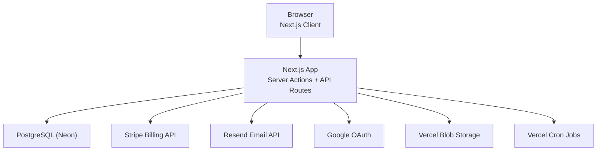
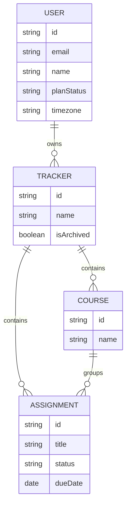

# Tracklet — System Architecture & Technical Overview

Tracklet (https://tracklet.me) is a **table‑first assignment tracking platform** designed for students who prefer spreadsheet‑style workflows over traditional task boards.

Instead of kanban boards or complex productivity systems, Tracklet focuses on:

- Fast spreadsheet‑style editing
- Clear deadline visibility
- Minimal UI friction
- Reliable reminder automation

This repository documents the **public technical architecture** behind Tracklet.

The production source code is **not included**. This repository exists to provide transparency into the engineering design and infrastructure powering the platform.

---

# System Overview

Tracklet is a **production SaaS web application** that enables students to track assignments, courses, and deadlines in a structured table interface.

The core product design focuses on:

- **High‑density data views** (spreadsheet interface)
- **Fast inline editing**
- **Minimal navigation overhead**
- **Reliable deadline reminders**
- **Subscription‑based SaaS monetization**

Unlike typical productivity tools that emphasize visual boards or dashboards, Tracklet prioritizes **structured data workflows** similar to Google Sheets.

---

# Technology Stack

| Layer | Technology |
|------|------------|
| Framework | Next.js 16 (App Router) |
| Language | TypeScript (strict mode) |
| UI Framework | Tailwind CSS v4 |
| UI Components | shadcn/ui |
| Data Table | TanStack Table v8 |
| ORM | Prisma v7 |
| Database | PostgreSQL 17 (Neon Serverless) |
| Authentication | NextAuth v5 |
| Payments | Stripe |
| Email | Resend |
| File Storage | Vercel Blob |
| Hosting | Vercel |
| CI/CD | GitHub Actions |
| Package Manager | pnpm |

---

# High‑Level Architecture

The system follows a **server‑centric architecture** where most mutations occur through **Next.js Server Actions**, while selected operations use lightweight API endpoints.

---

# Core Product Architecture

Tracklet is built around a **table‑first interaction model**.

The assignment table acts as the central UI where users can:

- Create assignments
- Edit fields inline
- Sort and filter tasks
- Track due dates
- Monitor course workloads

Key engineering patterns include:

- Optimistic UI updates
- Minimal server revalidation
- Strong relational database modeling
- Server‑side subscription enforcement

---

# Database Architecture

Tracklet uses a relational schema built on **PostgreSQL**.

Primary entities include:

- Users
- Trackers
- Courses
- Assignments

Additional support models handle:

- Authentication
- OAuth accounts
- Sessions
- Verification tokens
- Rate limiting

## Entity Relationships

---

# Authentication Architecture

Tracklet supports **two authentication strategies**.

### OAuth

- Google OAuth via NextAuth

### Credentials

- Email/password authentication
- bcrypt password hashing
- OTP verification
- Password reset flow

Security protections include:

- Login rate limiting
- Brute‑force protection
- Email enumeration prevention

---

# API Design

Tracklet exposes a minimal set of REST endpoints.

| Endpoint | Method | Purpose |
|--------|-------|--------|
| /api/auth/[...nextauth] | GET / POST | Authentication |
| /api/webhooks/stripe | POST | Stripe subscription lifecycle |
| /api/assignments/[id] | PATCH | Inline editing |
| /api/calendar/[token] | GET | iCalendar export |
| /api/upload/avatar | POST | Avatar upload |
| /api/cron/reminders | GET | Daily reminders |
| /api/cron/weekly-summary | GET | Weekly summaries |

---

# Background Jobs

Tracklet uses **Vercel Cron Jobs** to execute scheduled tasks.

## Daily Reminder Job

Runs at **08:00 UTC**.

Responsibilities:

- Detect upcoming assignments
- Send reminder emails

## Weekly Summary Job

Runs every Monday.

Generates:

- Upcoming assignments
- Overdue tasks

Emails are **timezone‑aware**.

---

# Subscription Model

Tracklet uses a **Stripe subscription architecture**.

| Plan | Features |
|-----|----------|
| Free | Up to 2 trackers |
| Pro ($3.99/month) | Unlimited trackers, reminders, calendar sync |

Subscription enforcement occurs at two levels:

1. UI restrictions
2. Server‑side validation

When a subscription expires:

- Existing trackers remain
- Creation of new trackers is restricted

---

# Security Architecture

Security was integrated early in development.

## HTTP Security Headers

- HSTS
- X‑Frame‑Options: DENY
- X‑Content‑Type‑Options: nosniff

## Password Security

Passwords are hashed using:

- bcrypt
- cost factor 12

## Login Rate Limiting

Maximum:

- 10 attempts per 15 minutes

Stored in the database.

## OTP Protection

- Maximum 5 attempts per token
- Token invalidated on lockout

## Webhook Security

Stripe webhook signatures are verified before processing.

---

# Performance Architecture

## Optimistic UI

Inline edits update the interface immediately while persisting asynchronously.

Benefits:

- Reduced latency perception
- Improved UX responsiveness

## Hydration Safety

Local storage UI states are synchronized using:

- useEffect
- suppressHydrationWarning

## Timezone Handling

Dates stored as:

- UTC midnight

Times stored separately to preserve timezone context.

DST‑safe offset calculations are applied during conversion.

---

# Infrastructure

| Component | Provider |
|----------|---------|
| Hosting | Vercel |
| Database | Neon |
| Payments | Stripe |
| Email | Resend |
| Storage | Vercel Blob |

---

# CI/CD Pipeline

Continuous integration runs through GitHub Actions.

Pipeline:

1. Type checking
2. Linting
3. Build validation

Build failures block deployment.

---

# Engineering Notes

Several architectural decisions shaped Tracklet's design.

### Table‑First UX

Most productivity apps emphasize dashboards or boards.

Tracklet instead focuses on **structured tabular workflows**.

### Optimistic Editing

Inline edits avoid full page revalidation to maintain responsiveness.

### Server Action Architecture

Next.js Server Actions simplify:

- authentication
- validation
- mutation logic

### Subscription Enforcement

Limits are enforced both client‑side and server‑side to prevent bypassing.

---

# System Status

Tracklet is currently:

- Production deployed
- Feature complete
- CI verified
- Actively maintained

---

# Source Code Availability

Tracklet is a **commercial SaaS product**.

This repository documents architecture while keeping the proprietary implementation private.

The purpose is to balance:

- Technical transparency
- Engineering credibility
- Sustainable product development
